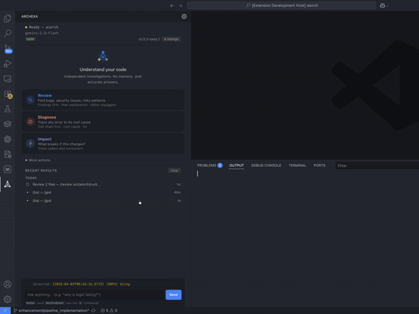
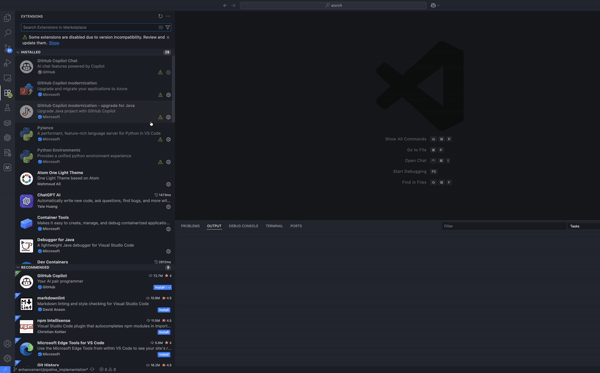
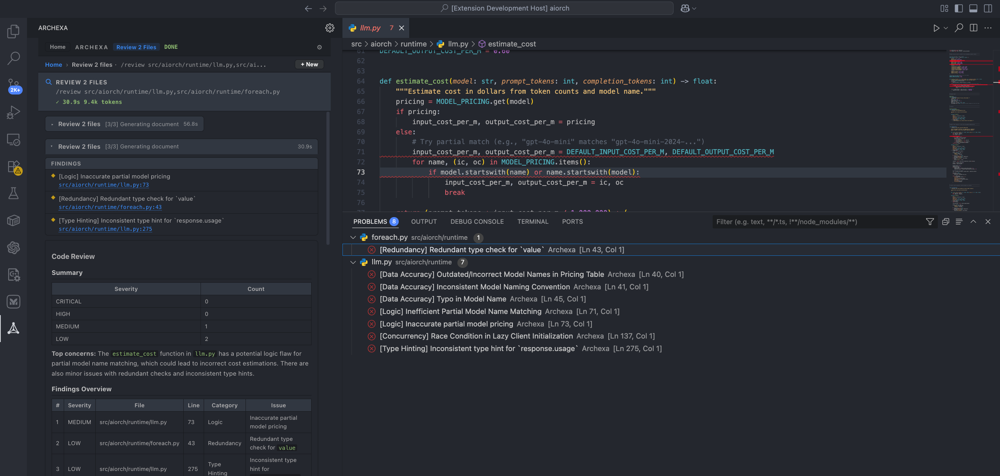
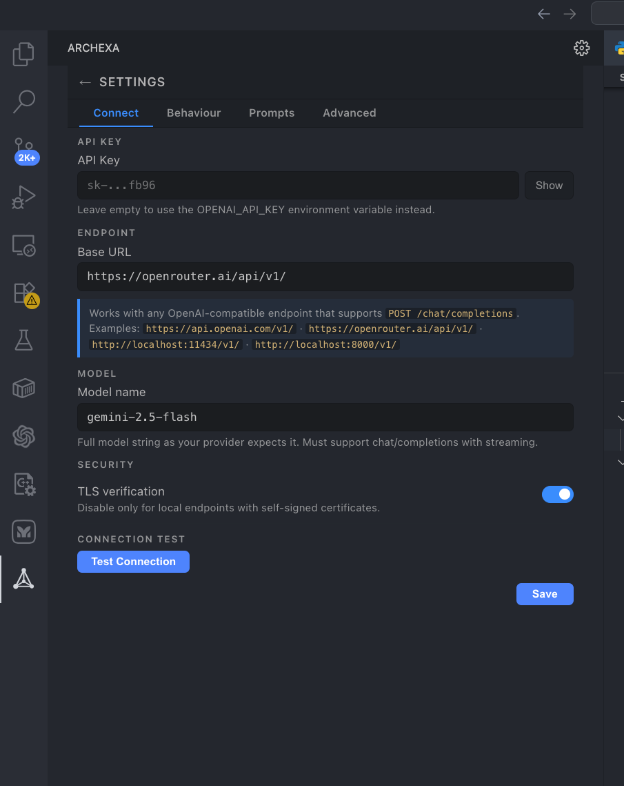
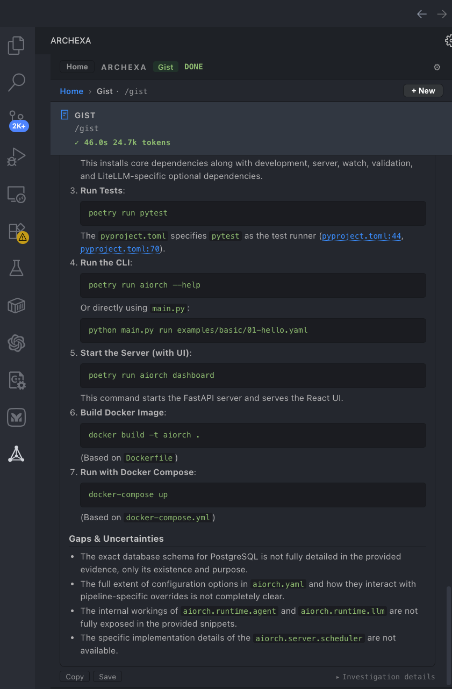

# Archexa (Beta) — AI-Powered Codebase Intelligence

> **Beta Release** — This extension is under active development. Features are stable but the binary is not yet code-signed. On macOS, the extension handles quarantine removal automatically. Please report issues on [GitHub](https://github.com/ereshzealous/archexa-vscode/issues).

Diagnose errors, review code, query architecture, and trace impact — all powered by a self-contained binary with deep agentic investigation.

This extension is powered by the [Archexa CLI](https://github.com/ereshzealous/archexa) — a self-contained binary that handles AST parsing, agentic investigation, and LLM synthesis.



---

## How to Install
**Install from Extensions in VS Code is preferered**
For Full details Please gro through this Blog - [Medium Blog](https://medium.com/@eresh-gorantla/architecture-breaks-silently-i-built-a-tool-that-finds-out-why-88de58fa8c2e)



---

## Features

### Review
Cross-file architecture-aware code review. Finds security issues, resource leaks, and interface mismatches that linters miss. Findings appear as inline squiggles in the editor.

`Cmd+Shift+R` / `Ctrl+Shift+R`

### Diagnose
Root-cause errors from selection, clipboard, or log files. Traces call chains and reads surrounding code to find the cause.

`Cmd+Shift+D` / `Ctrl+Shift+D`

### Impact
What breaks if this file changes? Traces callers, consumers, and interface contracts to predict downstream impact.

`Cmd+Shift+I` / `Ctrl+Shift+I`

### Query
Ask any question about your codebase. The LLM reads files and traces flows to answer with evidence.

`Cmd+Alt+Q` / `Ctrl+Shift+Q`

### Gist
Quick codebase overview: tech stack, key modules, how things connect. Great for onboarding.

### Analyze
Full architecture documentation with multi-phase AST analysis. Produces commit-ready markdown.

---

## Review Findings

Review findings appear as **inline squiggles** in the editor and in the VS Code **Problems panel**, just like TypeScript or ESLint diagnostics.

- Red = error
- Yellow = warning
- Blue = info



---

## How It Works

1. **Scan** — Tree-sitter AST parsing extracts imports, signatures, call patterns
2. **Investigate** (deep mode) — The LLM reads files, greps patterns, traces callers
3. **Synthesize** — Evidence is assembled into a context-optimized prompt for the final output

---

## Quick Start

1. Install the extension from the VS Code Marketplace
2. The setup wizard downloads the Archexa binary automatically (~20 MB, no Python required)
3. Set your API key in **Settings > Connection** (any OpenAI-compatible endpoint)
4. Right-click any file > **Archexa**, or use keyboard shortcuts



---

## Sidebar

The unified sidebar provides:

- **Command wizard** — Two-step flow: pick a command, then fill in the form
- **Chat** — Streaming results with live agent steps and collapsible history
- **Settings** — Connection, Behaviour, Prompts, and Advanced tabs
- **History** — Recent results with date groups, token usage, and duration

---

## Gist & Architecture Output

Run **Gist** for a quick overview or **Analyze** for full architecture documentation with Mermaid diagrams.



---

## Deep Mode

Every command supports **deep mode** — an agentic investigation where the LLM reads files, greps for patterns, traces callers, and iterates before generating output.

Deep mode finds cross-file issues that pipeline mode misses. Toggle it in **Settings > Behaviour**.

---

## Supported Languages

Python, TypeScript, JavaScript, Go, Java, Rust, Ruby, C#, Kotlin, Scala, C++, C, PHP

---

## Project Files

Archexa stores all generated files inside your project directory:

```
your-project/
  .archexa/                  ← created automatically
    config.yaml              ← extension config (synced from Settings UI)
    *.md                     ← generated output (review, gist, analyze results)
  .archexa_cache/            ← tree-sitter AST cache (managed by CLI)
```

On first activation, the extension offers to add `.archexa/` and `.archexa_cache/` to your `.gitignore`.

---

## Requirements

- VS Code 1.85+
- An OpenAI-compatible API key (OpenAI, OpenRouter, Ollama, vLLM, LiteLLM, etc.)
- Internet connection for LLM API calls only — scanning is fully offline

---

## Settings

Open **Archexa: Open Settings** from the command palette, or configure via VS Code settings:

| Setting | Description | Default |
|---------|-------------|---------|
| `archexa.apiKey` | API key (or set `OPENAI_API_KEY` env var) | — |
| `archexa.model` | LLM model | `gpt-4o` |
| `archexa.endpoint` | API base URL | `https://api.openai.com/v1/` |
| `archexa.deepByDefault` | Use agentic deep mode by default | `true` |
| `archexa.showInlineFindings` | Show review findings as editor squiggles | `true` |
| `archexa.excludePatterns` | Glob patterns to exclude from scanning | `.archexa/**` |
| `archexa.outputDir` | Directory for generated output files | `.archexa` |

See all settings in **Settings > Advanced**.

For full documentation — all commands, settings, custom prompts, LLM providers, and troubleshooting — see the **[Usage Guide](USAGE.md)**.

---

## Privacy

Archexa runs entirely on your machine. The binary scans your code locally using AST parsing. Only LLM prompts (containing code context) are sent to the API endpoint you configure. No code is sent to Archexa servers. No telemetry. No account required.

---

## Troubleshooting

### macOS: "cannot be opened" or binary blocked

macOS Gatekeeper may block the downloaded binary. The extension removes the quarantine flag automatically, but if it fails you'll see a notification with a **"Fix Permissions"** button. Or run manually:

```bash
xattr -d com.apple.quarantine ~/.vscode/globalStorage/EreshGorantla.archexa/bin/archexa
```

### Commands fail silently

Check the Output panel: **View > Output** > select **"Archexa"** from the dropdown. Set `archexa.logLevel` to `"DEBUG"` for verbose output.

---

## Platforms

macOS (Apple Silicon + Intel) | Linux (x86_64 + ARM) | Windows (x64)

---

## Links

- [VS Code Marketplace](https://marketplace.visualstudio.com/items?itemName=EreshGorantla.archexa)
- [Extension Source (GitHub)](https://github.com/ereshzealous/archexa-vscode)
- [Archexa CLI (GitHub)](https://github.com/ereshzealous/archexa)
- [Report Issues](https://github.com/ereshzealous/archexa-vscode/issues)

---

## License

Apache 2.0
